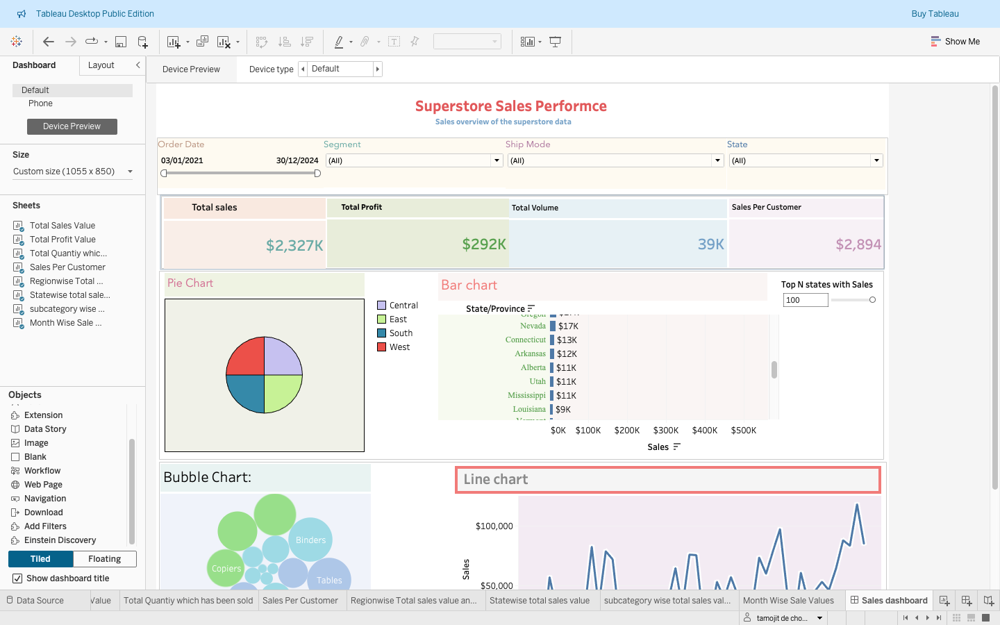

# 📊 Superstore Sales Performance Dashboard

## 📌 Project Overview
This Tableau project delivers a **comprehensive Sales Performance Dashboard** for the **Sample Superstore** dataset.  
The dashboard highlights **key KPIs**, provides **regional & category-level analysis**, and enables **interactive filtering** to empower data-driven decision-making for business stakeholders.

---

## 🎯 Objectives
- **Track** overall sales performance using KPI scorecards.
- **Analyze** sales distribution across regions, states, and categories.
- **Identify** top-performing states dynamically using a parameter.
- **Visualize** monthly sales trends and category-level performance.
- **Enable interactivity** through actionable filters and drill-downs.

---

## 📂 Dataset Details
- **Source**: Tableau’s built-in *Sample Superstore* dataset  
- **Data Fields**:
  - **Dimensions**: Order Date, Ship Mode, Segment, State, Region, Category, Sub-Category, Customer ID
  - **Measures**: Sales, Profit, Quantity

---

## 📏 Metrics Calculation

| Metric               | Formula                                                                                  | Notes |
|----------------------|------------------------------------------------------------------------------------------|-------|
| **Total Sales**      | `SUM([Sales]) / 1000`                                                                    | Displayed in thousands (K) |
| **Total Profit**     | `SUM([Profit]) / 1000`                                                                   | Displayed in thousands (K) |
| **Total Volume**     | `SUM([Quantity])`                                                                        | Count of total items sold |
| **Sales per Customer** | `(SUM([Sales]) / COUNTD([Customer ID])) / 1000`                                         | Average sales per unique customer in K |
| **% of Total Sales** | `(SUM([Sales]) / TOTAL(SUM([Sales])))`                                                   | Used in Pie Chart |
| **Top N States**     | `RANK(SUM([Sales])) <= [Top N Parameter]`                                                | Controlled via parameter |

---

## 📈 Dashboard Features

### **1. KPI Scorecards**
- **Total Sales** – displayed in K format, colored `#76b7b2`.
- **Total Profit** – displayed in K format.
- **Total Volume** – shows total quantity sold.
- **Sales Per Customer** – calculated metric for average sales.

### **2. Visualizations**
- **Pie Chart** – % of Total Sales by Region (Summer palette, black borders, currency formatting).
- **Bar Chart** – Top *N* States by Sales (parameter-driven, sorted descending).
- **Bubble Chart** – Sales by Sub-category (colored by Category).
- **Line Chart** – Monthly Sales Trend (MMM YY format, date range filter).

### **3. Filters**
- **Order Date** – range filter applied to all worksheets.
- **Segment** – multiple values drop-down.
- **Ship Mode** – multiple values drop-down.
- **State** – excluded from Bar Chart filter.

### **4. Interactivity**
- Pie Chart & Bubble Chart act as **Action Filters**.
- Parameter control for dynamic *Top N* state selection.

---

## 🖥️ Dashboard Layout
The dashboard is structured using **containers** for clarity:

1. **Title/Logo** – Dashboard name & shopping cart icon.
2. **Filters Row** – All filters horizontally aligned.
3. **KPI Row** – Total Sales, Profit, Volume, Sales per Customer.
4. **Pie & Bar Chart Row**
5. **Bubble & Line Chart Row**

**Fixed Size**: 1055 x 850 px  
**Fit**: Entire View

---

## 🛠️ Tools Used
- **Tableau Desktop** (202x)
- **Sample Superstore Dataset**

---

## 📊 Key Insights
- Regional sales are uneven, with certain regions outperforming significantly.
- Top N states analysis reveals sales concentration in specific geographies.
- Monthly sales trends indicate seasonal patterns.
- Category-level breakdown identifies high-revenue product lines.

---

## 🚀 How to Use
1. Download the `.twbx` file from this repository.
2. Open in **Tableau Desktop**.
3. Use filters & parameters to interact with the dashboard.

---

## 📷 Dashboard Preview

  

---

## 📢 Author
**Tamojit De Chowdhury**  
_Data Analyst | Tableau Enthusiast_  

